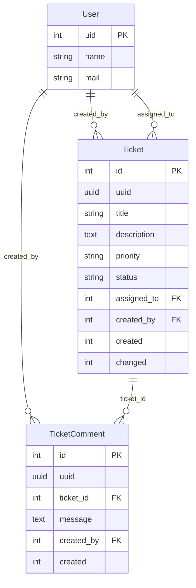

# Data model — Support Ticket Management

Storage: Drupal 11 **custom content entities** in module `ticket_management`, MySQL/MariaDB via DDEV.  
**Not** core Node or core Comment entities.

Machine field names use snake_case; API may expose camelCase aliases (see [`api-contract.md`](api-contract.md)).

---

## Entity relationship diagram

---

## Enumerations

### Priority (`priority`)

| Value | Label |
|-------|--------|
| `low` | Low |
| `medium` | Medium |
| `high` | High |
| `critical` | Critical |

Default on create: `medium` (unless UI specifies otherwise).

### Status (`status`)

| Value | Label | Terminal |
|-------|--------|----------|
| `open` | Open | No |
| `in_progress` | In Progress | No |
| `resolved` | Resolved | No |
| `closed` | Closed | Yes |
| `cancelled` | Cancelled | Yes |

Default / only allowed initial value: `open`.

### Allowed status transitions

| From | To |
|------|-----|
| `open` | `in_progress` |
| `open` | `cancelled` |
| `in_progress` | `resolved` |
| `in_progress` | `cancelled` |
| `resolved` | `closed` |

---

## Entity: User (core `user`)

Seeded only. Referenced by tickets and comments; not defined by this module.

| Logical field | Drupal | Notes |
|---------------|--------|--------|
| id | `uid` | Integer PK |
| name | `name` | Display / login |
| mail | `mail` | Optional for display |

---

## Entity: Ticket (`ticket`)

**Entity type id:** `ticket`  
**Class:** `Drupal\ticket_management\Entity\Ticket`  
**Keys:** `id`, `uuid`, `label` → `title`

| Logical (requirements) | Base field name | Type | Required | Notes |
|--------------------------|-----------------|------|----------|--------|
| id | `id` | integer | yes | Serial PK |
| (uuid) | `uuid` | uuid | yes | Drupal standard |
| title | `title` | string | yes | Max 255; entity label |
| description | `description` | string_long | yes | Plain text; escape on output |
| priority | `priority` | list_string | yes | Enum above |
| status | `status` | list_string | yes | Enum above; mutate via state machine only |
| assignedTo | `assigned_to` | entity_reference → `user` | no | Nullable; must exist if set |
| createdBy | `created_by` | entity_reference → `user` | yes | Set on create from current user (not client-spoofable without admin) |
| createdAt | `created` | created | yes | Unix timestamp |
| updatedAt | `changed` | changed | yes | Unix timestamp; auto-bump on save |

### Indexes (recommended)

- `status`
- `assigned_to`
- `created`
- Composite optional: `(status, created)`

### Constraints

- `title`: required, length 1–255  
- `description`: required, length 1–10000 (configurable cap)  
- `priority` / `status`: allowed values only  
- `assigned_to`: empty or loadable user  
- On insert: `status` forced to `open`  
- On update: `status` changes only through `TicketStateMachine`

---

## Entity: Ticket comment (`ticket_comment`)

**Entity type id:** `ticket_comment`  
**Class:** `Drupal\ticket_management\Entity\TicketComment`  
**Keys:** `id`, `uuid`, `label` → truncated `message` or id

| Logical (requirements) | Base field name | Type | Required | Notes |
|--------------------------|-----------------|------|----------|--------|
| id | `id` | integer | yes | Serial PK |
| (uuid) | `uuid` | uuid | yes | |
| ticketId | `ticket_id` | entity_reference → `ticket` | yes | Parent ticket; delete policy: cascade or restrict (prefer restrict + app delete rules; MVP has no ticket delete) |
| message | `message` | string_long | yes | Plain text; Twig-escaped on render |
| createdBy | `created_by` | entity_reference → `user` | yes | Current user on create |
| createdAt | `created` | created | yes | Unix timestamp |

No `changed` field required (append-only).

### Indexes

- `ticket_id`
- `(ticket_id, created)` for chronological listing

### Constraints

- `message`: required, length 1–5000  
- `ticket_id`: must reference existing `ticket`  
- XSS: store as plain string; never mark admin/XSS-filtered as safe HTML in Twig

---

## Relationships summary

| From | To | Field | Cardinality | On missing target |
|------|-----|-------|-------------|-------------------|
| Ticket | User | `created_by` | many → one | Required; validated |
| Ticket | User | `assigned_to` | many → one (optional) | 422 if invalid id; display “Unknown user” if orphaned historically |
| TicketComment | Ticket | `ticket_id` | many → one | 404 if ticket missing on create |
| TicketComment | User | `created_by` | many → one | Required |

---

## Persistence notes

- Tables created via entity schema / `drush entup` equivalent (`drush updb` / entity definition installs on module enable).
- Config/export: entity type definitions in code; no need for Field UI config for base fields.
- Config sync directory remains `config/sync` for site config; content data stays in SQL tables.
