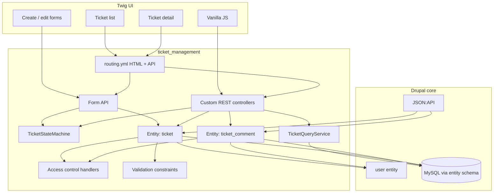

# Design notes — Support Ticket Management

Architecture for custom module `ticket_management` (Drupal 11, DDEV, PHP 8.3, MySQL/MariaDB).

**Inputs:** [`requirements-analysis.md`](requirements-analysis.md) · [`tool-specific/cursor-workflow/spec.md`](tool-specific/cursor-workflow/spec.md) · [`data-model.md`](data-model.md) · [`api-contract.md`](api-contract.md)  
**UI:** [`ui-flow.md`](ui-flow.md)  
**Tests:** [`test-strategy.md`](test-strategy.md)

---

## Architecture overview



| Layer | Responsibility |
|-------|----------------|
| Twig + vanilla JS | Screens, progressive enhancement, error/empty/loading UI |
| Form API / controllers | HTML request handling, CSRF, messengers |
| Custom REST + JSON:API | Programmatic CRUD / search / transition |
| `TicketStateMachine` | Sole authority for status transitions |
| `TicketQueryService` | Keyword + status list queries (Database API) |
| Custom content entities | Persistence and field definitions |
| Access handlers + permissions | Authorization |

Custom code lives under `web/modules/custom/ticket_management`. No Node.js build step.

---

## Backend design

### Entity types

| Entity type id | Class | Extends | Purpose |
|----------------|-------|---------|---------|
| `ticket` | `Entity\Ticket` | `ContentEntityBase` | Support ticket |
| `ticket_comment` | `Entity\TicketComment` | `ContentEntityBase` | Comment on a ticket |

**Not used for this domain:** `node`, core `comment`, taxonomy, media, paragraphs.

Handlers (entity annotation / attributes):

- `access` → `TicketAccessControlHandler` / `TicketCommentAccessControlHandler`
- `form` → add / edit forms
- `list_builder` → admin/list helper (UI list may use query service)
- `view_builder` → detail rendering
- `storage` → default SQL content entity storage

### Base fields

Defined in `baseFieldDefinitions()` — see [`data-model.md`](data-model.md).

**Ticket:** `title`, `description`, `priority`, `status`, `assigned_to`, `created_by`, `created`, `changed` (+ `id`, `uuid`).  
**Ticket comment:** `ticket_id`, `message`, `created_by`, `created` (+ `id`, `uuid`).

`preSave` on Ticket: force `status = open` on insert; refuse direct status mutation unless a trusted flag/path set by the state machine (or status is only written inside `TicketStateMachine::apply()`).

### Access control handler

Map entity operations to module permissions:

| Operation | Permission (typical) |
|-----------|----------------------|
| `view` | `view ticket` / `view ticket_comment` (or via parent ticket) |
| `create` | `create ticket` / `create ticket comment` |
| `update` | `edit ticket` (comments: deny update in MVP) |
| `delete` | deny in MVP (or admin only) |
| status transition | checked on route/controller via `transition ticket status` |

Handlers call `$account->hasPermission(...)`; optional owner checks later. REST/HTML routes declare `_permission` or `_entity_access`.

### Validation constraints

| Mechanism | Use |
|-----------|-----|
| Field settings | required, max length, allowed values (`list_string`) |
| Entity reference | target type `user` / `ticket`; validate target exists |
| Custom constraint + validator | optional `TicketStatusTransitionConstraint` if status is ever set on entity save outside service |
| Service-level | `TicketStateMachine::assertTransition()` for transitions |
| Form / REST | mirror constraints; map `EntityConstraintViolation` → form errors / 422 JSON |

Priority/status enums enforced as allowed values lists. Assignee validated as existing uid when non-null.

### State machine & query services

- `ticket_management.state_machine` — transition matrix, `canTransition` / `assertTransition` / `apply`
- `ticket_management.ticket_query` — `Connection`-based list with `q`, `status`, pagination

Controllers and forms depend on these via DI — no business rules in Twig or JS.

---

## Database design

**Content entities map to MySQL tables automatically via Drupal’s entity schema.** On module install / entity definition updates, Drupal creates and maintains base data tables (e.g. `ticket`, `ticket_field_data` pattern as applicable) and field tables. **No manual `CREATE TABLE` SQL is required** for Ticket or TicketComment unless we deliberately introduce custom non-entity tables (we do not for MVP).

| Concern | Approach |
|---------|----------|
| Schema create/update | Entity type + base field definitions → core entity schema API |
| Apply updates | `ddev drush en ticket_management -y` / `ddev drush updb` as needed |
| Indexes | Declare via field definitions / entity indexes where supported; avoid hand-written SQL |
| Search | `TicketQueryService` queries entity base tables through Database API |
| Seeds | Users via User entity API / Drush; sample tickets via entity `save()` or install hook — still no raw SQL required |

Optional later: custom `{ticket_stats}` style tables would need `hook_schema()` — **out of scope** unless explicitly chosen.

---

## Frontend design

| Choice | Detail |
|--------|--------|
| Templates | Twig under `ticket_management/templates/` |
| Forms | Drupal Form API (create, edit, search filters, comment, transition) |
| JS | Vanilla JS in `js/` attached via `ticket_management.libraries.yml` |
| CSS | Simple module CSS; no Sass/Webpack pipeline |
| Build | **None** — no Node.js, npm, yarn, Vite, etc. |
| XSS | Twig auto-escape; never `|raw` on user title/description/message |
| Enhancement | Optional `fetch` to REST for transitions/comments with Drupal CSRF token |

Screen-by-screen behavior: [`ui-flow.md`](ui-flow.md).

Routes (HTML): `/tickets`, `/tickets/add`, `/tickets/{ticket}`, `/tickets/{ticket}/edit`.

---

## Validation strategy

```text
Request → AuthN/AuthZ → Input shape (JSON/form)
       → Field / entity constraints
       → Domain rules (state machine, ticket exists for comment)
       → Persist
       → Response / rebuild form
```

| Layer | Examples |
|-------|----------|
| Transport | JSON decode; required keys |
| Field | lengths, enums, references |
| Domain | legal transitions; status not on PATCH |
| Authz | permissions before mutate |
| Output | escape all user text in Twig; JSON returns plain strings |

Empty search keyword is valid (means “no text filter”). Invalid status filter value → 422 / form error, not empty result pretending success.

---

## Error handling strategy

### Backend

| Case | HTTP / Form | Persistence |
|------|-------------|-------------|
| Unauthenticated | 401 / login redirect | none |
| Forbidden | 403 | none |
| Missing ticket | 404 | none |
| Validation / illegal transition | 422 + error envelope / form errors | none |
| Server failure | 500 + log | none / transaction rollback |

Custom REST uses the error envelope in [`api-contract.md`](api-contract.md). Forms use `$form_state->setErrorByName()` and messengers. Domain exceptions from the state machine are caught at the edge and converted to 422 — not uncaught 500s for expected illegal transitions.

Concurrent transitions: always re-load entity status before `assertTransition`; stale client target → 422.

### Frontend

Per-screen **loading / empty / success / error** states documented in [`ui-flow.md`](ui-flow.md). Failures must be visible (banner or inline field errors); no silent submit.

---

## Testing

See [`test-strategy.md`](test-strategy.md) for unit/kernel/functional scope, PHPUnit via `ddev exec`, and mapping to acceptance criteria / edge cases.

---

## Design decisions (summary)

1. Custom content entities only for tickets/comments.  
2. State machine is a standalone service.  
3. Status changes only via transition API/UI path.  
4. List search uses Database API service, not Views-as-primary.  
5. Schema from entity API — no manual SQL for MVP tables.  
6. Twig + vanilla JS only.
