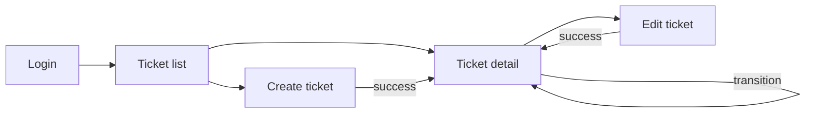

# UI flow — Support Ticket Management

Twig + Form API + vanilla JS (no Node build). Routes under `/tickets*`.  
Auth: seeded users; mutating screens require login.

Related: [`design-notes.md`](design-notes.md) · [`api-contract.md`](api-contract.md)

---

## Screen map

| Screen | Path | Primary actions |
|--------|------|-----------------|
| Ticket list | `/tickets` | Search, status filter, open detail, go to create |
| Create ticket | `/tickets/add` | Submit create, cancel to list |
| Ticket detail | `/tickets/{ticket}` | View fields, transition status, add comment |
| Edit ticket | `/tickets/{ticket}/edit` | Update non-status fields |

---

## 1. Ticket list (search / filter)

### Layout

- Page title: Tickets  
- Actions: **Create ticket** button  
- Filters: keyword text field (`q`), status select (All + enum values), **Apply** / **Reset**  
- Results table/cards: id, title, status, priority, assignee, updated  
- Pagination when `total > limit`

### States

| State | When | UI |
|-------|------|-----|
| **Loading** | Initial paint waiting on query, or filter submit in progress | Disabled filter controls; skeleton/spinner on results region; `aria-busy="true"` |
| **Empty** | Query succeeds with `total === 0` (including “no matches” for filters) | Message: “No tickets found.” + hint to clear filters or create; table hidden |
| **Success** | One or more rows | Results rendered; pagination if needed; filters retain submitted values |
| **Error** | Permission denied, 5xx, invalid status value | Error banner (e.g. “Unable to load tickets.” / validation on status); previous results cleared or left with error overlay—prefer clear + banner |

### Behavior notes

- Empty keyword + All status → full list (success, not error).  
- Row click / **View** → detail.  
- No client-side bundle; optional JS only to disable double-submit on Apply.

---

## 2. Create ticket form

### Layout

- Fields: title, description, priority, assignee (optional user select from seeded users)  
- **Status not shown** (or read-only “Open”) — server sets `open`  
- Actions: **Create**, **Cancel** (→ list)

### States

| State | When | UI |
|-------|------|-----|
| **Loading** | Page load (assignee options) or submit in flight | Spinner on assignee if needed; submit button disabled + “Saving…” |
| **Empty** | N/A as page state (form always shown). Empty **assignee list** if seed failed | Inline warning: “No users available to assign.”; create still allowed without assignee |
| **Success** | 201 / form save OK | Messenger success; redirect to detail |
| **Error** | 422 / form validation / 403 | Field-level errors (title, description, priority, assignedTo); banner for non-field errors; stay on form with input preserved |

### Validation reflected in UI

- Required title/description/priority  
- Invalid assignee → error on assignee field  

---

## 3. Ticket detail (status controls + comments)

### Layout

- Header: title, id, status badge, priority  
- Meta: createdBy, assignedTo, createdAt, updatedAt  
- **Status controls:** buttons or select listing **only** `getAllowedTargets(current)`; hidden/disabled when terminal (`closed` / `cancelled`) with note “No further transitions”  
- **Edit** link (non-status fields) if permitted  
- **Comments:** chronological list + **Add comment** form (`message` + submit)  
- Back to list

### States

| State | When | UI |
|-------|------|-----|
| **Loading** | Loading ticket + comments; or transition/comment submit pending | Detail skeleton; action buttons disabled during mutation |
| **Empty** | Ticket loaded but **zero comments** | Comments region: “No comments yet.” + comment form still visible if allowed |
| **Success** | Ticket + comments rendered; after transition/comment | Updated status badge / new comment in list; success messenger or inline confirmation |
| **Error** | 404 ticket; illegal transition; comment validation; network | 404 page or “Ticket not found.”; transition error banner (e.g. “Transition from Open to Closed is not allowed.”); comment field error if message empty; do not update status/comments on failure |

### Transition UX

- Client may hide illegal targets, but **server always validates**.  
- On concurrent stale transition → error state with refresh guidance.

### Comment XSS

- Render `message` / title / description with Twig escaping only (no `|raw`).

---

## 4. Edit ticket form

### Layout

- Same mutable fields as create (title, description, priority, assignee)  
- Status displayed read-only with link/note: change via detail transitions  
- **Save**, **Cancel** → detail

### States

| State | When | UI |
|-------|------|-----|
| **Loading** | Load entity; save in progress | Form disabled / Saving… |
| **Empty** | N/A (404 handled as error) | — |
| **Success** | Save OK | Messenger; redirect to detail |
| **Error** | Validation / 403 / 404 | Field errors or not-found page; values preserved on validation failure |

---

## Required states checklist (per screen)

| Screen | Loading | Empty | Success | Error |
|--------|---------|-------|---------|-------|
| Ticket list | Yes | Yes (no rows) | Yes (rows) | Yes |
| Create form | Yes (submit / options) | Assignee empty warning | Yes (redirect) | Yes (field/banner) |
| Ticket detail | Yes | Yes (no comments) | Yes | Yes (404 / transition / comment) |
| Edit form | Yes | — | Yes (redirect) | Yes |

---

## Accessibility & feedback

- Use Drupal messengers and/or `role="alert"` for errors.  
- Disable primary buttons while **loading** to prevent double POST.  
- Preserve filter and form input across **error** responses.  
- Status badge text matches labels in [`data-model.md`](data-model.md) (`In Progress`, etc.).
